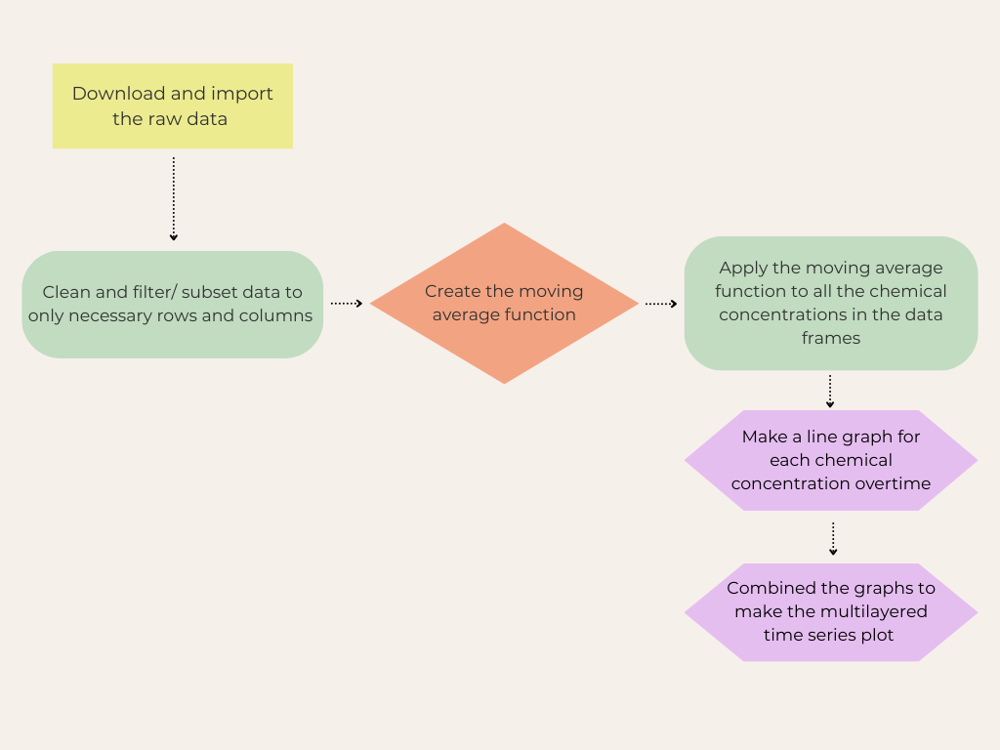

# Reproducing a Time Series Plot

## Chemical fluxes within the Puerto Rico's Luquillo Experimental Forest watershed before and after Hurricane Hugo

### Purpose

The project aims to reproduce the time series plot from Dr. Douglas's research, which examines chemical concentrations in the Luquillo Experimental Forest's watersheds following Hurricane Hugo (Schaefer, McDowell, Scatena, and Asbury 2000) .

### Flowchart

The project's workflow is displayed in a flowchart to provide a clear representation of the sequential processes involved.

### Contents

-   Data: the raw data
-   Docs: rendered HTML documents
-   Figs: the time series plot and other illustrations
-   Outputs: new created data frames
-   Paper: the report as a quarto doc
-   R: created functions
-   Scratch_work: preliminary work, code drafts, notes

### How to download and run locally:

1)  Download 4 csv files:

-   Quebrada one-Bisley (Q1) Chemistry Data
-   Quebrada two-Bisley (Q2) Chemistry Data
-   Quebrada three-Bisley (Q3) Chemistry Data
-   Puente Roto Mameyes (MPR) Chemistry Data

From EDI Data Portal: <https://portal.edirepository.org/nis/mapbrowse?packageid=knb-lter-luq.20.4923064> or from the data folder in the GitHub repository

2)  0_init_environment script contains the packages required for data cleaning and analysis
3)  1\_ import_clean_data script cleans and filters the data frames

### Authors

Megan Hessel, a graduate student at UCSB Bren's School of Environmental Science and Management

### References 

SCHAEFER, DOUGLAS. A.; McDOWELL, WILLIAM H.; SCATENA, FREDRICK N.; ASBURY,CLYDE E. 2000. Effects of hurricane disturbance on stream water concentrations and fluxes in eight tropical forest watersheds of the Luquillo Experimental Forest, Puerto Rico. Journal of Tropical Ecology 16:189±207.
