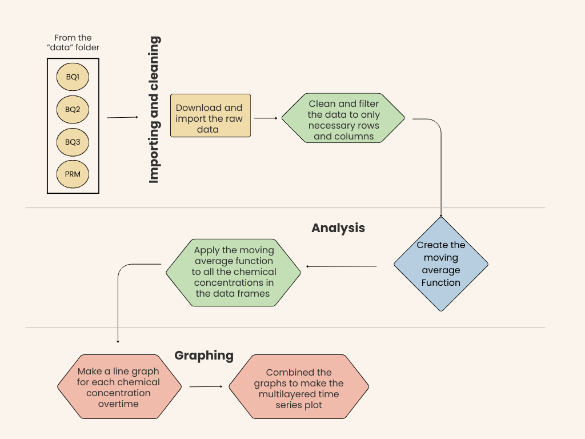

# Reproducing a Time Series Plot

## Chemical fluxes within the Puerto Rico's Luquillo Experimental Forest watershed before and after Hurricane Hugo

### Purpose

The project aims to reproduce the time series plot from Dr. Douglas's research, which examines chemical concentrations in the Luquillo Experimental Forest's watersheds following Hurricane Hugo (Schaefer, McDowell, Scatena, and Asbury 2000) .

### Contents

-   [Data](https://github.com/meganhessel/eds214_final_data_investigation/tree/main/data): the raw data
-   [Docs](https://github.com/meganhessel/eds214_final_data_investigation/tree/main/docs): rendered HTML documents
-   [Figs](https://github.com/meganhessel/eds214_final_data_investigation/tree/main/figs): the time series plot and other illustrations
-   [Outputs](https://github.com/meganhessel/eds214_final_data_investigation/tree/main/outputs): intermediate outputs (created data frames)
-   [Paper](https://github.com/meganhessel/eds214_final_data_investigation/tree/main/paper): the report as a quarto doc
-   [R](https://github.com/meganhessel/eds214_final_data_investigation/tree/main/R): created functions
-   [Scratch_work](https://github.com/meganhessel/eds214_final_data_investigation/tree/main/scratch_work): preliminary work, code drafts, notes
-   [In the root](https://github.com/meganhessel/eds214_final_data_investigation): data cleaning, analysis, and graphing script (listed 0 to 3 to indicate order of processing)

### Flowchart

The project's workflow is displayed in a flowchart to provide a clear representation of the sequential processes involved.

### How to download and run locally:

1)  Download 4 csv files from [EDI Data Portal](https://portal.edirepository.org/nis/mapbrowse?packageid=knb-lter-luq.20.4923064) or from the [data](https://github.com/meganhessel/eds214_final_data_investigation/tree/main/data) folder in the GitHub repository:

    -   Quebrada one-Bisley (Q1) Chemistry Data

    -   Quebrada two-Bisley (Q2) Chemistry Data

    -   Quebrada three-Bisley (Q3) Chemistry Data

    -   Puente Roto Mameyes (PRM) Chemistry Data

2)  "0_init_environment" script contains the packages required for data cleaning and analysis.

3)  "1\_ import_clean_data" script cleans and filters the data frames.

    -   To properly replicate the time series plot, only sample id, sample date (from 1988 to 1996), and the chemical concentrations (K, NO3-N, Mg, Ca, NH4-N) are necessary.

4)  The moving average (ma) function takes an average of the chemical concentrations within a 9 weeks time window (4.5 weeks before and 4.5 weeks after) of each sample date.

    -   "2_process_moving_avg" script applies the ma function to each chemical concentration at each site

5)  "3_graphing" script makes multiple time series plots for each chemical concentration; then accumulates all the graphs to properly replicate Dr. Douglas's plot.

### Author

Megan Hessel, a graduate student at UCSB Bren's School of Environmental Science and Management

### References

SCHAEFER, DOUGLAS. A.; McDOWELL, WILLIAM H.; SCATENA, FREDRICK N.; ASBURY,CLYDE E. 2000. Effects of hurricane disturbance on stream water concentrations and fluxes in eight tropical forest watersheds of the Luquillo Experimental Forest, Puerto Rico. Journal of Tropical Ecology 16:189±207.
